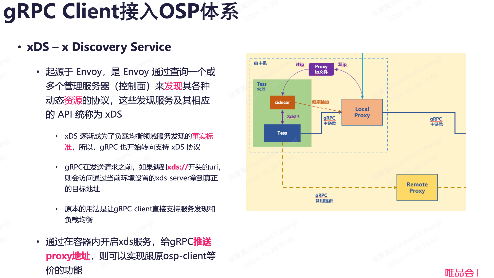

# gRPC

## 介绍

[gRPC C++](https://zhuanlan.zhihu.com/p/589436751)

## 常用类和方法

### `grpc::ClientAsyncResponseReader<R>`

Async API for client-side unary RPCs, where the message response received from the server is of type R.

- `StartCall()`：异步发起 RPC 调用。
- `Finish(R *msg, grpc::Status *status, void *tag)`：等待 RPC 调用完成，并获取响应结果。

