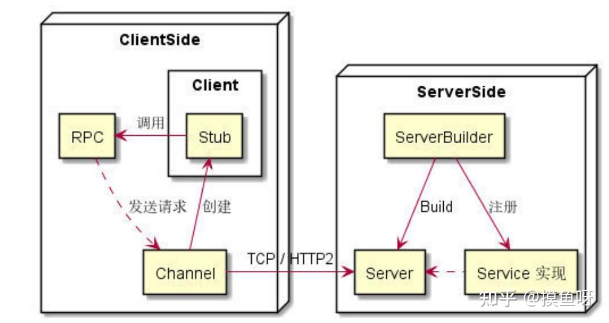

# merger3

curl 'localhost:7920/metrics' | grep 'merger3_call_hub_size'

select avg(toInt64OrNull(extract(message, ', cost_time:(\d+),'))) as cost_time
from @table
where message like '%api=feeds,%' and `message` like '%_merger3_%' and `message` like '%send%'

quantile(0.99)

select quantile(0.99)(toInt64OrNull(extract(message, 'total time=(\d+)'))) as cost_time
from @table
where message like '%api=feeds,%' and `message` like '%send%'
and host LIKE 'gd18-001-merger3-rec-feeds-7pvn8e-7f7b9dc45f-lmdtv%'
and `message` like '%prerank_succeed%'

select sum(toInt64OrNull(extract(message, 'rank_missed_item_size=(\d+)'))) as size_p99
from @table
where message like '%hub.rec.goods.landc.zsp_05.mix%'and `message` like '%reco-brand-outer-goods%'and `message` like '%send%'and `message` not like '%rank_missed_item_size=0%'

统计日志种类
SELECT
    extract(message, 'key:\\s*"merger3_abtid"\\s+value:\\s*"([^"]+)"') AS merger3_abtid_value,
    count() AS cnt
FROM @table
WHERE message LIKE '%recv%'
  AND message LIKE '%api=relevance,%'
  AND match(message, 'key:\\s*"merger3_abtid"\\s+value:\\s*"[^"]+"')
GROUP BY merger3_abtid_value;

SELECT
    extract(message, '10063\\|key:([^|]+)') AS key_10063,
    count() AS cnt
FROM @table
WHERE message LIKE '%send%'
  AND message LIKE '%api=recall,%'
  and `message` like '%10063|key:%|value_byte_size:0|operation_type:0|hm_value_size:0|10093%'
  AND match(message, '10063\\|key:[^|]+')
GROUP BY key_10063
ORDER BY cnt DESC
LIMIT 10;

SELECT
toStartOfMinute(timestamp) as minute,
avg(toInt64OrNull(extract(message, ', total time=(\d+)'))) total_took,
quantile(0.99)(toInt64OrNull(extract(message, ', total time=(\d+)'))) total_took_99
FROM @table
WHERE `message` LIKE '%abt_id=11661_1166111006%' and `message` like '%send response%'
group by minute
order by minute desc

查看监控行数
curl localhost:7920/metrics | wc -l

host LIKE 'gd16-002-merger3-rec-288jne-6f546fbf55-28zdg%' and `message` like '%which exceeds the maximum limit of 700K%'

## 启动服务

### 本地

terminal1:  ./server_XXX --logtostderr --mock_tracer  --server_addr=

terminal2:  export CARBON_METRICS_HTTP_ADDR=127.0.0.1:35881
            ./client_XXX  --logtostderr --api=XXX --dp=1 --item_size=5 --timeout=200 --qps=1 --domain=

terminal3:  ./server_featurehub --logtostderr --server_hub_addr=

### staging

```bash
./start_staging_server.sh v3 rec
./start_staging_server.sh featurehub
./client_rec --logtostderr=true --dura=1 --qps=1 --api=feeds --domain=127.0.0.1:12392
```

### 补充

查看端口是否被占用 netstat -vanp tcp | grep 端口号

编译某个服务 ./build.sh --version v3 --scene featurehub

10.189.108.33

### 模拟超时

```C++
for (size_t i = 0; i < flow_dataset.slices.size(); ++i) {
      auto& msg = fit->second[i];
      auto& slice = flow_dataset.slices[i];

      const tesseract::ResultList* result_list = msg.response_result_list(model.data(), is_tess_score);
      if (!result_list || session_->flow_handler()->current_flow_type() == FlowDefine::RANK) {
        AddSliceInfo(dispatcher_index, dispatcher_label, slice, false);
        LOG(WARNING) << "ParseHubResponse response empty, request_id=" << session()->unique_request_id()
                     << " tess=" << tess << " model=" << model << " is_tess_score=" << is_tess_score << " index=" << i;
        continue;
      }
```

## entity

数据团队生成数据，生成到 Redis 或 RocksDB，Entity 用来存储数据。

将数据序列化后，将二进制数据填入到 entity 中。

数据团队生成数据，生成到 Redis 或 RocksDB，Entity 用来存储数据。

将数据序列化后，将二进制数据填入到 entity 中。

### builder

helper：选择哪个级别的 entity。

builder：定义构建 entity 的基本配置，可以根据具体的业务场景实现不同的 EntityBuilder 和 DocBuilder。

list_entity：解析给定的 JSON 数据并填充 QueryProcessInfo 对象。

### entity_builder

level 0: 用户侧数据，请求级别的数据，比如用户、上下文等；

level 1: 商品侧数据，排序级别的数据，比如商品、品牌、档期等；

KVEntityBuilder：从 Redis 中获取。

## session

AdaptInputAbt：兼容 abt 参数，进行参数适配以及过滤无关参数。

OnRecvRequest() 方法是接收到请求后的主入口，负责初始化一些必要的字段（如 unique_request_id_），适配请求参数，并调用具体的请求处理逻辑。

OnSendResponse() 方法在流程结束后调用，用于生成最终的响应。它还会记录一些相关的日志，并上报相关的监控指标。

RunFlow() 方法启动整个流程的执行。它会初始化一个流程对象，并开始执行流程中的各个步骤。

FlowCallback() 方法用于处理流程中的各个步骤，当一个步骤完成后，它会决定是否继续执行下一个步骤。

## 名词解释

Entity: Tess 中的特征数据结构，包括 id type value 三个字段，业务根据 type 区分不同类型；

Match: 将 Impression 数据和多个 Entity 数据，根据 Impression 中的 entities 字段拼接到一起，就能得到一条完整的样本。

FE: 特征抽取模块。

Entity -> Match -> FE

灰度发布：在生产环境中逐步向用户群体推出新功能或版本的方式。

Benchmark：基准测试，通过运行特定的测试任务来评估系统或组件在执行这些任务时的效率和速度，从而提供性能指标。

DSSM: Deep Structured Semantic Models，一个深度学习模型。

A/B 测试：（也被称为对比测试和分桶测试）旨在用于对比两个版本的内容的效果，识别哪一个版本对于访客/查看者更具吸引力。

ANTLR4：解析器生成器，用于读取、处理、执行或翻译结构化文本或二进制文件。


