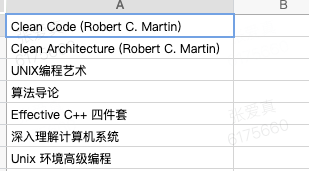

#

1. string_view 和 string 区别使用的方法
2. git rebase  fixup squash 区别
2.1 合并分支
3. hdfs
4. string pool
5. jni java 本地方法接口
6. 脚本 nohup

1. lldb

1. 算法 YouTube + leetcode 电子书
2. Cmake
3. coroutine
4. STL 源码剖析
5. Redis 面经
6. std::move

